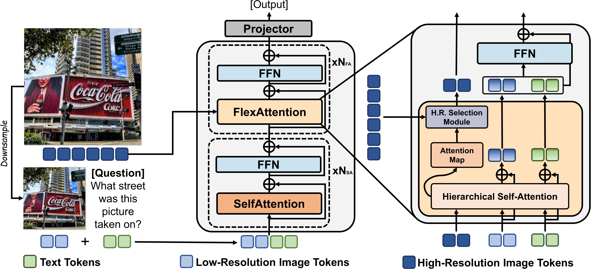

# FlexAttention for Efficient High-Resolution Vision-Language Models

[[Project Page](https://vis-www.cs.umass.edu/flexattention/)] [[Paper](https://arxiv.org/pdf/2407.20228)]

## Overview



This repository contains the official code for FlexAttention for Efficient High-Resolution Vision-Language Models.

## News

* Jan 2025: Training documentation released.
* July 2024: Open-source codebase and evaluation.
* July 2024: Accepted by ECCV'2024!

## Installation

```bash
conda create -n flexattention python=3.9
conda activate flexattention
pip install -e .
pip install -e ".[train]"
pip install -e ./transformers
```

## Checkpoint

You can download our 7B model checkpoint from [huggingface](https://huggingface.co/senfu/llava-v1.5-7b-flexattn) and put it into `checkpoints` folder.

## Evaluation

### TextVQA

1. Follow this [instruction](https://github.com/haotian-liu/LLaVA/blob/main/docs/Evaluation.md#textvqa) to download the textvqa evaluaton images and annotation, and extract to `datasets/eval/textvqa`.
2. Run the multi-gpu inference:
```bash
torchrun --nproc_per_node 3 scripts/evaluation/eval_textvqa.py --dist --model-path checkpoints/llava-v1.5-7b-flexattn --id llava-v1.5-7b-flexattn
```
It will generate a file similar to `answer_textvqa_llava-v1.5-7b-flexattn_xxx.jsonl` on the folder root.

3. Run the evaluation script:
```bash
bash scripts/evaluation/get_textvqa_score.sh ANSWER_FILE
```

### V* Bench

1. Download the dataset from huggingface.

```bash
git lfs install
git clone https://huggingface.co/datasets/craigwu/vstar_bench
```

2. Run the multi-gpu inference:
```bash
# Attribute
torchrun --nproc_per_node 3 scripts/evaluation/eval_vbench.py --dist --model-path checkpoints/llava-v1.5-7b-flexattn --id llava-v1.5-7b-flexattn --subset direct_attributes

# Spatial
torchrun --nproc_per_node 3 scripts/evaluation/eval_vbench.py --dist --model-path checkpoints/llava-v1.5-7b-flexattn --id llava-v1.5-7b-flexattn --subset relative_position
```

### MagnifierBench

1. Download the dataset from [here](https://drive.google.com/file/d/1DE5PBkhHMdVNOpDg6GtfzO73ZFrK9ltZ/view?usp=sharing), and extract it to `datasets/eval/`.

2. Run the multi-gpu inference:
```bash
torchrun --nproc_per_node 3 scripts/evaluation/eval_magnifier.py --dist --model-path checkpoints/llava-v1.5-7b-flexattn --id llava-v1.5-7b-flexattn
```


## Training

### Prepare Data

First, follow LLaVA's [instruction](https://github.com/haotian-liu/LLaVA?tab=readme-ov-file#visual-instruction-tuning) to prepare the image and annotation. The overall folder structure will look like this:

```
playground
├── llava_v1_5_mix665k
       ├── llava_v1_5_mix665k.json
       ├── coco
       │   └── train2017
       ├── gqa
       │   └── images
       ├── ocr_vqa
       │   └── images
       ├── textvqa
       │   └── train_images
       └── vg
           ├── VG_100K
           └── VG_100K_2
```

Then, run the data cleaning script to clean the data.
```
python tools/prepare_data.py
```

In this script, we perform the following actions:
1. Insert a placeholder `<image>` tag for samples containing only text.
2. Correct any incorrect image file extensions found in the original data.
3. Remove samples that use non-existent images.

You can directly download the prepared file [here](https://drive.google.com/file/d/13KibuGxvI-Py4o3BoE-52LJge934lPMM/view?usp=sharing).

### Prepare Model Weight

Initialize the weights for the newly added high-resolution projection layers.

```
python tools/download_model.py
python tools/prepare_model.py
```

### Start Training

Finally, run the training script:

```
bash scripts/train/llava-v1.5-7b-flexattn.sh
```

## Acknowledgement

[LLaVA](https://github.com/haotian-liu/LLaVA): the codebase that our project build on. Thanks for their amazing code and model.

## Citation

If our work is useful or relevant to your research, please kindly recognize our contributions by citing our paper:

```
@misc{li2024flexattention,
      title={FlexAttention for Efficient High-Resolution Vision-Language Models}, 
      author={Junyan Li and Delin Chen and Tianle Cai and Peihao Chen and Yining Hong and Zhenfang Chen and Yikang Shen and Chuang Gan},
      year={2024},
      eprint={2407.20228},
      archivePrefix={arXiv},
      primaryClass={cs.CV},
      url={https://arxiv.org/abs/2407.20228}, 
}
```
